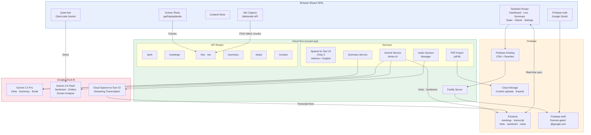
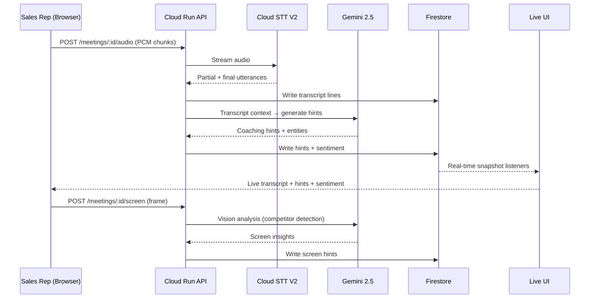
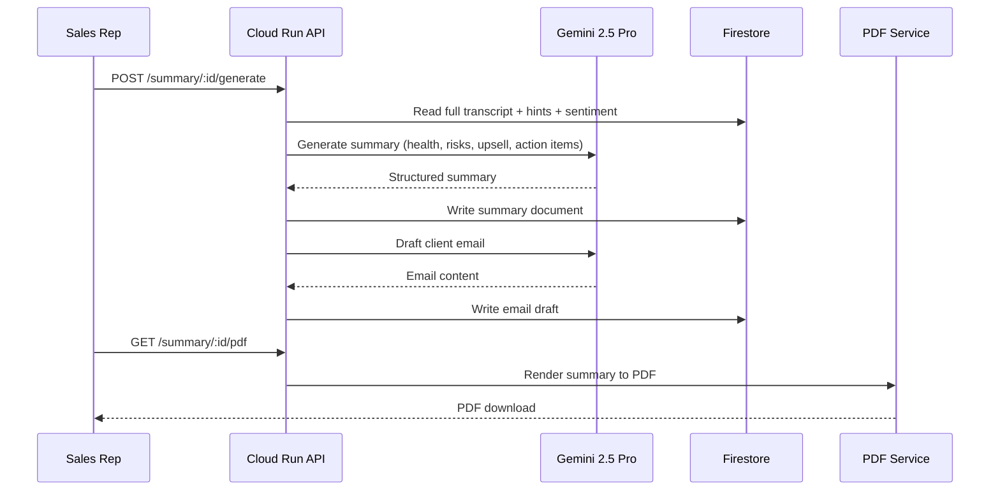

# Sally — Your AI Sales Assistant

Real-time AI assistant that runs alongside Google Meet during Google Cloud sales calls. Listens to audio via Cloud Speech-to-Text V2 (Chirp 3), surfaces competitive and coaching hints using Gemini 2.5 Pro/Flash, tracks live sentiment, and produces post-meeting deliverables (internal summary + client email draft + PDF export).

**Live:** [agentic-system-488914.web.app](https://agentic-system-488914.web.app)
**Internal tool — `@google.com` access only.**

---

## Architecture



### Data Flow — Live Meeting



### Post-Meeting Summary Flow



---

## Stack

| Layer    | Technology                                                             |
| -------- | ---------------------------------------------------------------------- |
| Monorepo | pnpm workspaces                                                        |
| Frontend | Vite + React 18 + TypeScript + TanStack Router + Zustand               |
| Backend  | Node 20 + Fastify 5 + TypeScript                                       |
| Auth     | Firebase Auth + Google OAuth (Workspace Internal, `@google.com`)        |
| Database | Firestore (Native mode, `nam5` multi-region)                            |
| Storage  | Cloud Storage (context uploads, PDF exports)                            |
| STT      | Cloud Speech-to-Text V2 (Chirp 3, `he-IL` + `en-US` bilingual)         |
| LLM      | Gemini 2.5 Pro / Flash via Vertex AI (server) + browser-direct (Quiet Ask) |
| Hosting  | Firebase Hosting (CDN) + Cloud Run (`scoach-api`, `us-central1`)        |
| CI/CD    | Cloud Build → Artifact Registry → Cloud Run / Firebase Hosting          |

---

## Project Layout

```
apps/
  web/          # React SPA (Vite + TanStack Router)
  api/          # Cloud Run service (Fastify)
packages/
  types/        # Shared TypeScript types (Meeting, Hint, Transcript, etc.)
  ui/           # Design system primitives + icon set
  tokens/       # Design tokens (CSS variables)
  tsconfig/     # Shared tsconfig presets
infra/
  terraform/    # GCP project infra (Cloud Run, Firestore, Storage, Monitoring)
  firebase/     # Firestore rules, indexes, Storage rules
  cloudbuild/   # CI/CD pipeline configs
scripts/        # Deployment and utility scripts
docs/
  adr/          # Architecture decision records
  runbooks/     # Operational runbooks
spikes/
  audio-capture/ # WebAudio + getDisplayMedia proof-of-concept
```

---

## Features

- **Dashboard** — Meeting history, top clients, coach insights, team activity
- **Pre-Meeting Wizard** — Set goals, language, stage, upload client context docs
- **Live Coaching** — Real-time transcript, AI coaching hints, sentiment tracking, screen share analysis, private notes
- **Quiet Ask** — Private Q&A with Gemini during live calls (client-side, not visible to others)
- **Post-Meeting Summary** — AI-generated internal summary with health score, risks, upsell opportunities, action items
- **Client Email Draft** — Auto-generated follow-up email ready to send
- **PDF Export** — Downloadable meeting summary with bilingual support (Hebrew + English)
- **Tasks** — Action items aggregated across all meetings
- **Clients** — Client directory with meeting history per account
- **Sharing** — Share meeting summaries with teammates

---

## Local Development

Requires Node 20.10+ and pnpm 9+.

```bash
pnpm install
pnpm dev          # starts web (5173) + api (8080) in parallel
pnpm test         # runs all workspace tests
pnpm typecheck
pnpm lint
```

The web app uses [MSW](https://mswjs.io/) in development, so it works without the API service running.

---

## Deployment

### Web (Firebase Hosting)
```bash
cd apps/web && pnpm build
firebase deploy --only hosting
```

### API (Cloud Run)
```bash
gcloud builds submit --config=cloudbuild.yaml
```

---

## Environment Variables

| Variable | Where | Description |
| --- | --- | --- |
| `GCP_PROJECT_ID` | API | Google Cloud project for Vertex AI + STT |
| `FIREBASE_PROJECT_ID` | API | Firebase project ID |
| `GOOGLE_APPLICATION_CREDENTIALS` | API | Service account key path |
| `VITE_FIREBASE_*` | Web | Firebase client config (apiKey, authDomain, etc.) |
